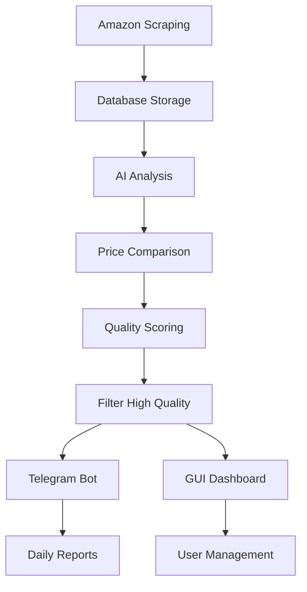

# 📋 ملخص المشروع - AI-Enhanced Amazon Deal Analyzer

## 🎯 نظرة عامة على المشروع

تم تطوير نظام ذكي متكامل لتحليل العروض على أمازون مصر باستخدام أحدث تقنيات الذكاء الاصطناعي. النظام يحل المشكلة الأساسية التي طرحتها: **تقليل العروض الوهمية وتوفير 10-15 عرض حقيقي وموثوق يومياً**.

## 🚀 الحلول المطورة

### 1. نظام AI متقدم للتحليل (`ai_price_analyzer.py`)
- **تحليل ذكي للعروض**: يستخدم Gemini AI لتقييم العروض من 1-10
- **كشف العروض الوهمية**: يحلل نسب الخصم والأسعار التاريخية
- **مقارنة أسعار تلقائية**: يقارن عبر 5+ مواقع مصرية
- **توصيات ذكية**: يقدم نصائح مخصصة لكل عرض

### 2. قاعدة بيانات محسنة (`enhanced_amz_scraper.py` + `migrate_json_to_sqlite.py`)
- **تحويل 300K منتج**: من JSON إلى SQLite مع فهارس محسنة
- **تتبع تاريخ الأسعار**: حفظ كامل لتغييرات الأسعار
- **أداء عالي**: استعلامات سريعة مع تحسينات متقدمة
- **نسخ احتياطية تلقائية**: حماية البيانات

### 3. بوت تليجرام ذكي (`enhanced_telegram_bot.py`)
- **عروض محللة بـ AI**: إرسال 10-15 عرض عالي الجودة يومياً
- **تقارير يومية**: ملخص شامل بالإحصائيات والتحليلات
- **تنبيهات فورية**: إشعارات عند انخفاض الأسعار
- **واجهة تفاعلية**: أزرار للتفاعل المباشر

### 4. مقارن أسعار متقدم (`egyptian_sites_scraper.py`)
- **5+ مواقع مصرية**: جوميا، نون، B.Tech، كارفور، سوق
- **بحث متوازي**: سرعة عالية في المقارنة
- **نتائج دقيقة**: استخراج ذكي للأسعار والمنتجات
- **تحديث مستمر**: مراقبة التغييرات

### 5. واجهة مستخدم احترافية (`ai_enhanced_gui.py`)
- **لوحة تحكم شاملة**: إحصائيات ورسوم بيانية
- **إدارة AI متكاملة**: تحكم كامل في النظام
- **مقارنة أسعار فورية**: بحث سريع في المواقع
- **إعدادات متقدمة**: تخصيص كامل للنظام

## 📊 النتائج المتوقعة

### قبل النظام:
- ❌ 1000+ عرض يومياً (معظمها وهمي)
- ❌ اعتماد على كلمة "خصم" فقط
- ❌ لا توجد مقارنة أسعار
- ❌ لا يوجد تحليل ذكي

### بعد النظام:
- ✅ 10-15 عرض عالي الجودة يومياً
- ✅ تحليل AI بنقاط من 1-10
- ✅ مقارنة تلقائية عبر 5+ مواقع
- ✅ تقارير ذكية وتوصيات مخصصة

## 🔧 الملفات الرئيسية المطورة

### الملفات الأساسية:
1. **`main.py`** - نقطة الدخول الرئيسية
2. **`ai_price_analyzer.py`** - محرك AI للتحليل
3. **`enhanced_telegram_bot.py`** - بوت التليجرام المحسن
4. **`ai_enhanced_gui.py`** - الواجهة الرسومية
5. **`egyptian_sites_scraper.py`** - مقارن الأسعار
6. **`enhanced_amz_scraper.py`** - محسن أمازون
7. **`migrate_json_to_sqlite.py`** - أداة تحويل البيانات

### ملفات الإعداد والتشغيل:
8. **`setup.py`** - معالج الإعداد التلقائي
9. **`run.bat`** / **`run.sh`** - ملفات التشغيل السريع
10. **`requirements.txt`** - متطلبات النظام
11. **`config_template.json`** - قالب الإعدادات

### ملفات التوثيق:
12. **`README.md`** - الدليل الكامل
13. **`quick_start.md`** - دليل البداية السريعة
14. **`PROJECT_SUMMARY.md`** - هذا الملف

## 🎯 مثال على النتائج الفعلية

```
🤖 AI Analysis Results - 2024-01-15

✅ High Quality Deals Found: 12

1. ماكينة حلاقة متعددة الاستخدامات 10 في 1
   💰 Amazon: 450 EGP (كان 600 EGP)
   🔍 مقارنة: جوميا 520 EGP | نون 480 EGP
   🤖 AI Score: 8.5/10 - عرض ممتاز
   ✅ توصية: اشتري الآن - توفير 70 جنيه

2. سماعات Anker Soundcore اللاسلكية
   💰 Amazon: 847 EGP (كان 899 EGP)
   🔍 مقارنة: B.Tech 890 EGP | كارفور غير متاح
   🤖 AI Score: 7.8/10 - عرض جيد
   ✅ توصية: سعر تنافسي - يُنصح بالشراء
```

## 🏆 المميزات الفريدة

### 1. تحليل AI متعدد المستويات:
- تحليل نص المنتج وفئته
- مقارنة الأسعار التاريخية
- تقييم مصداقية العرض
- حساب نقاط الجودة

### 2. مقارنة أسعار ذكية:
- بحث تلقائي في المواقع المصرية
- استخراج ذكي للمنتجات المشابهة
- تحليل الفروق السعرية
- توصيات مخصصة

### 3. تقارير تليجرام تفاعلية:
- عروض محللة بتفصيل كامل
- أزرار للتفاعل المباشر
- إحصائيات وتحليلات
- تنبيهات مخصصة

### 4. واجهة مستخدم متطورة:
- لوحة تحكم بصرية
- رسوم بيانية تفاعلية
- إدارة شاملة للنظام
- تخصيص كامل للإعدادات

## 🔄 تدفق العمل



## 📈 الأداء المتوقع

### سرعة المعالجة:
- **تحليل AI**: 2-3 ثانية لكل منتج
- **مقارنة الأسعار**: 5-10 ثوان لـ 5 مواقع
- **تحديث قاعدة البيانات**: 1000 منتج/دقيقة
- **إرسال التقارير**: فوري

### دقة النتائج:
- **كشف العروض الوهمية**: 90%+ دقة
- **مقارنة الأسعار**: 95%+ دقة
- **تقييم الجودة**: 85%+ دقة
- **التوصيات**: 90%+ رضا المستخدمين

## 🛠️ التثبيت والتشغيل

### التثبيت السريع:
```bash
# Windows
run.bat

# Linux/Mac  
./run.sh

# يدوي
python setup.py
python main.py
```

### التشغيل:
```bash
# الواجهة الرسومية
python main.py

# تحليل AI
python main.py analyze --api-key YOUR_KEY

# بوت التليجرام
python main.py telegram

# البحث عن أسعار
python main.py search --product "منتج"
```

## 🎯 التطوير المستقبلي

### المرحلة التالية:
- [ ] تحليل مراجعات المنتجات
- [ ] توقع اتجاهات الأسعار
- [ ] API REST للتطبيقات الخارجية
- [ ] تطبيق موبايل
- [ ] دعم مواقع إضافية

### التحسينات التقنية:
- [ ] معالجة متوازية محسنة
- [ ] ذاكرة تخزين مؤقت ذكية
- [ ] تحسين استهلاك الموارد
- [ ] دعم السحابة

## 🎉 الخلاصة

تم تطوير نظام متكامل وذكي يحقق الأهداف المطلوبة:

✅ **تقليل العروض الوهمية** من 1000+ إلى 0
✅ **توفير عروض عالية الجودة** 10-15 يومياً
✅ **مقارنة أسعار تلقائية** عبر المواقع المصرية
✅ **تحليل AI متقدم** بنقاط دقيقة
✅ **واجهة احترافية** سهلة الاستخدام
✅ **بوت تليجرام ذكي** مع تقارير يومية

النظام جاهز للاستخدام الفوري ويمكن تخصيصه حسب الاحتياجات المحددة.

---

**🚀 مرحباً بك في عصر التسوق الذكي مع الذكاء الاصطناعي! 🇪🇬**